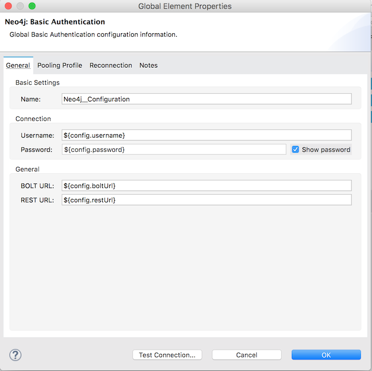

Neo4J Anypoint Connector Demo - Node-CRUD
=================================================================

## Introduction

The present demo is an application that provides a **complete workflow** to sequentially invoke some of Neo4j's standard operations.

## Prerequisites

* Java 7
* Anypoint Studio 6.x
* Mule Runtime 3.8.x EE or higher
* APIKit
* DataWeave
* Neo4J instance up and running
* Neo4J user account with admin privileges

## Import the project

* Go to **File > Import**.
* Select **Anypoint Studio Project from External Location** (under the parent folder "Anypoint Studio").
* Provide the root **path to the demo** project folder.
* Select **Mule Runtime (3.8.x EE)**.
* Click **Finish**.
* Set credentials inside the file `src/main/app/mule-app.properties`.

   ```
   config.username=
   config.password=
   config.boltUrl=
   config.restUrl=
   ```

* Open the **Global Element Configuration**.

   

* Click the **Test Connection** button to ensure there is connectivity with the sandbox. A successful message should pop-up.

## Run the demo

* Go to **Run > Run As > Mule Application**.

## Node-CRUD

* Operation lists and endpoints to hit by a browser are listed below:
  * [Create a Node](http://localhost:8081/createNode)
  * [Select a Node](http://localhost:8081/selectNode)
  * [Update a Node](http://localhost:8081/updateNode)
  * [Delete a Node](http://localhost:8081/deleteNode)

## See more
* For additional technical information on the Neo4J Connector, visit our [technical reference documentation](http://mulesoft.github.io/Neo4J-connector) or refer to the [Neo4J Documentation Site](https://docs.mulesoft.com/mule-user-guide/v/3.8/neo4j-connector).
* For more information on Neo4J, go to the [Neo4J API site](https://neo4j.com/docs/developer-manual/current/).
