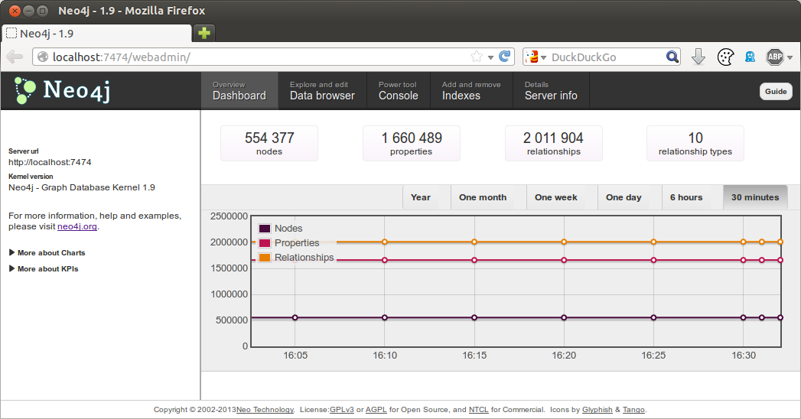
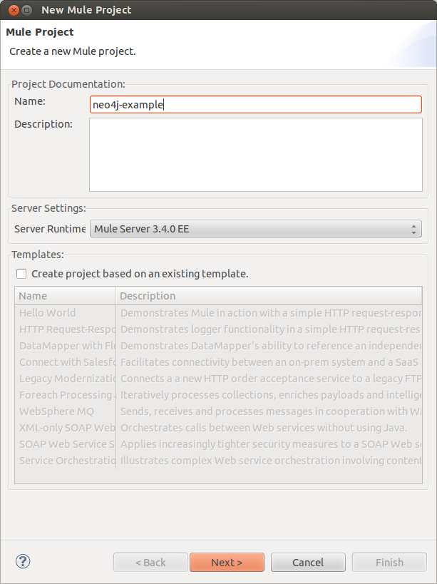
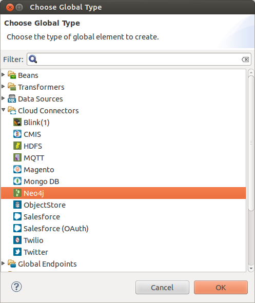
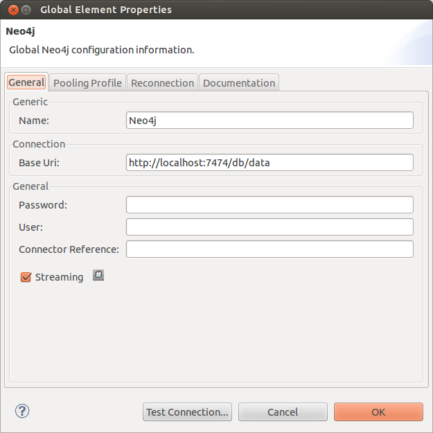
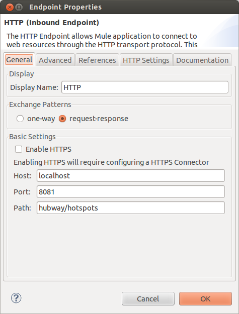
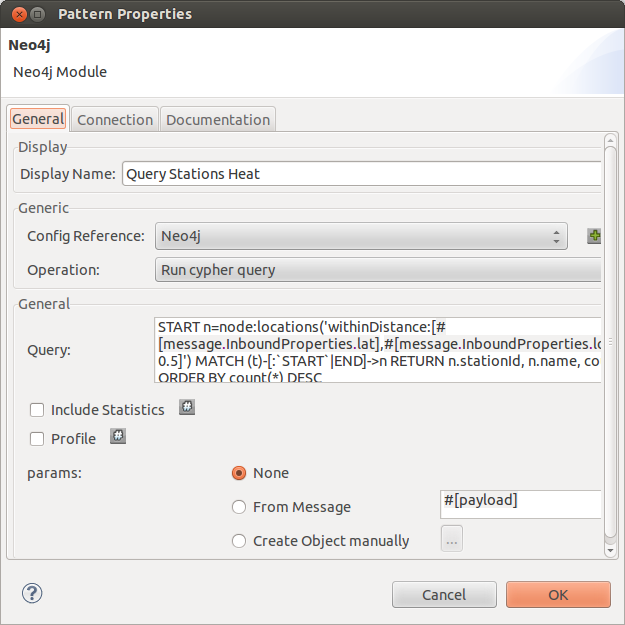
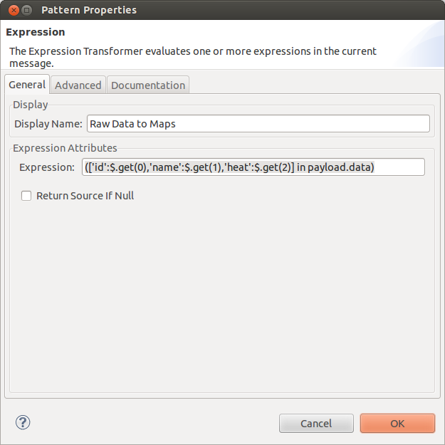
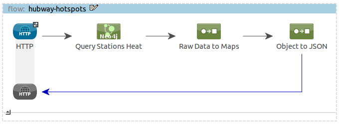

# Mule Sample: Querying a Neo4j graph database

## Purpose

Neo4j is a graph database that supports complex indexing and queries.
In this example, we will be using a ready made spatially-indexed database and use Mule to expose a rich query as a basic HTTP service.

## Prerequisites

In order to follow this sample walk-through you'll need:

- A working installation of [Neo4j Community](http://www.neo4j.org/download),
- The [Neo4j Spatial Server plugin](https://github.com/neo4j/spatial#using-the-neo4j-spatial-server-plugin) installed in your Neo4j server,
- A working installation of a recent version of [Mule Studio](http://www.mulesoft.org/download-mule-esb-community-edition).

### Loading sample data in Neo4j

Before we can start building our example application and start issuing queries to Neo4j, we need to load a sample dataset.
We will use the dataset provided by Neo4j for the [Hubway Data Challenge](http://blog.neo4j.org/2012/10/using-spring-data-neo4j-for-hubway-data.html).

> [Hubway](http://www.thehubway.com/) is a bike sharing service which is currently expanding worldwide. 

1. Download the dataset: [hubway_data_challenge_boston.zip](http://example-data.neo4j.org/files/hubway_data_challenge_boston.zip)
2. Stop your Neo4j server
3. In case you care, back-up your existing data, ie the `/path/to/neo/data` directory
4. Extract the zip file into `/path/to/neo/data/graph.db`
5. Start the server again
6. Browse the [Neo4j dashboard](http://localhost:7474/webadmin/) and confirm you have ~500K nodes loaded as shown below:

## Building the sample application

### Getting Mule Studio Ready

The Neo4j module doesn't come bundled with Mule Studio so we have to install it first.
For this, we have to do the following:

1. Open Mule Studio and from "Help" menu select "Install New Software...". The installation dialog - shown below - opens.
2. From "Work with" drop down, select "MuleStudio Cloud Connectors Update Site". The list of available connectors will be shown to you.
3. Find and select the Neo4j module in the list of available connectors, the tree structure that is shown below.
A faster way to find a specific connector is to filter the list by typing the name of the connector in the input box above the list.
You can choose more than one connector to be installed at once.
4. When you are done selecting the Neo4j module, click on "Next" button.
Installation details are shown on the next page.
Click on "Next" button again and accept the terms of the license agreement.
5. Click on "Finish" button. The Neo4j module is downloaded and installed onto Studio.
You'll need to restart the Studio for the installation to be completed.

### Setting up the project

Now that we've got Mule Studio up and running, it's time to work on the Mule Application.
Create a new Mule Project by clicking on "File > New > Mule Project".
In the new project dialog box, the only thing you are required to enter is the name of the project.
You can click on "Next" to go through the rest of pages.

The first thing to do in our new application is to configure the Neo4j connector to connect to our local server.

> We assume that you have not added security (password protection) nor changed the default port it listens to.

For this, in the message flow editor, click on "Global Elements" tab on the bottom of the page.
Then click on "Create" button on the top right of the tab.
In the "Choose Global Element" type dialog box that opens select "Neo4j" under "Cloud Connectors" and click OK.

In the Neo4j configuration dialog box that follows, set the name to "Neo4j". 

You are done with the configuration. Click "OK" to close the dialog box.

The XML for the global element should look like this:

    <neo4j:config name="Neo4j" doc:name="Neo4j">
        <neo4j:connection-pooling-profile
            initialisationPolicy="INITIALISE_ONE" exhaustedAction="WHEN_EXHAUSTED_GROW" />
    </neo4j:config>

### Building the HTTP service flow

It's time to start building the flow that will expose a Cypher query over HTTP
([learn more about the Cypher query language](http://www.neo4j.org/learn/cypher)).

Start by dropping an `HTTP` element on the visual editor and configure it as below:

The Cypher query we want to run is the following:

    START n=node:locations('withinDistance:[#[message.InboundProperties.lat],#[message.InboundProperties.lon], 0.5]')
    MATCH (t)-[:`START`|END]->n
    RETURN n.stationId, n.name, count(*)
    ORDER BY count(*) DESC

This query selects the Hubway stations 500 meters or less from the coordinates provided via two HTTP query parameters
(`lat` and `lon`, extracted with embedded MEL expressions),
and sorts them according to the amount of the trips that started or ended there.
This way, "hot" stations will come first in the list.

For this, drop one Neo4j element from the "Cloud Connectors" section of the Studio palette.
Edit its properties as shown below:

We want to return the results as a JSON array of objects, which will have the `id`, `name` and `heat` members.
For this we use an expression transformer to build a list of maps that we will then serialize as JSON.
This simple MEL projection performs the transformation: `(['id':$.get(0),'name':$.get(1),'heat':$.get(2)] in payload.data)`
So drop an expression transformer in the flow, right after the Neo4j query element and configure it as shown below:

Finally, drop an "Object to JSON" transformer in flow, after the expression transformer. 
Your flow should look very much like this:

### Flow XML

The final flow XML should be similar to this:

    <?xml version="1.0" encoding="UTF-8"?>
    <mule xmlns:json="http://www.mulesoft.org/schema/mule/json" xmlns:http="http://www.mulesoft.org/schema/mule/http"
        xmlns:neo4j="http://www.mulesoft.org/schema/mule/neo4j" xmlns:file="http://www.mulesoft.org/schema/mule/file"
        xmlns="http://www.mulesoft.org/schema/mule/core" xmlns:doc="http://www.mulesoft.org/schema/mule/documentation"
        xmlns:spring="http://www.springframework.org/schema/beans" version="EE-3.4.0"
        xmlns:xsi="http://www.w3.org/2001/XMLSchema-instance"
        xsi:schemaLocation="
            http://www.springframework.org/schema/beans http://www.springframework.org/schema/beans/spring-beans-current.xsd
            http://www.mulesoft.org/schema/mule/core http://www.mulesoft.org/schema/mule/core/current/mule.xsd
            http://www.mulesoft.org/schema/mule/neo4j http://www.mulesoft.org/schema/mule/neo4j/current/mule-neo4j.xsd
            http://www.mulesoft.org/schema/mule/file http://www.mulesoft.org/schema/mule/file/current/mule-file.xsd
            http://www.mulesoft.org/schema/mule/http http://www.mulesoft.org/schema/mule/http/current/mule-http.xsd
            http://www.mulesoft.org/schema/mule/json http://www.mulesoft.org/schema/mule/json/current/mule-json.xsd">
    
        <neo4j:config name="Neo4j" doc:name="Neo4j">
            <neo4j:connection-pooling-profile
                initialisationPolicy="INITIALISE_ONE" exhaustedAction="WHEN_EXHAUSTED_GROW" />
        </neo4j:config>
    
        <flow name="hubway-hotspots" doc:name="hubway-hotspots">
            <http:inbound-endpoint exchange-pattern="request-response"
                host="localhost" port="8081" path="hubway/hotspots" doc:name="HTTP" />
            <neo4j:run-cypher-query config-ref="Neo4j"
                query="START n=node:locations('withinDistance:[#[message.InboundProperties.lat],#[message.InboundProperties.lon], 0.5]')
    MATCH (t)-[:`START`|END]-&gt;n
    RETURN n.stationId, n.name, count(*)
    ORDER BY count(*) DESC"
                doc:name="Query Stations Heat" />
            <expression-transformer
                expression="(['id':$.get(0),'name':$.get(1),'heat':$.get(2)] in payload.data)"
                doc:name="Raw Data to Maps" />
            <json:object-to-json-transformer doc:name="Object to JSON" />
        </flow>
    </mule>

### Testing the application

Now it's time to test the application.
Run the application in Mule Studio using `Run As > Mule Application`.

Now browse to `http://localhost:8081/hubway/hotspots?lat=42.353412&lon=-71.044624` in your favorite browser.
You should see this JSON structure:

    [
        {
            "heat": 17529, 
            "id": 24, 
            "name": "Seaport Square - Seaport Blvd. at Boston Wharf"
        }, 
        {
            "heat": 12843, 
            "id": 64, 
            "name": "Congress / Sleeper"
        }, 
        {
            "heat": 7661, 
            "id": 7, 
            "name": "Fan Pier"
        }
    ]

## Other resources

For more information on:

- Neo4j Connector, please visit http://mulesoft.github.io/neo4j-connector
- Mule AnyPoint® connectors, please visit http://www.mulesoft.org/extensions
- Mule platform and how to build Mule applications, please visit  http://www.mulesoft.org/documentation/display/current/Home
